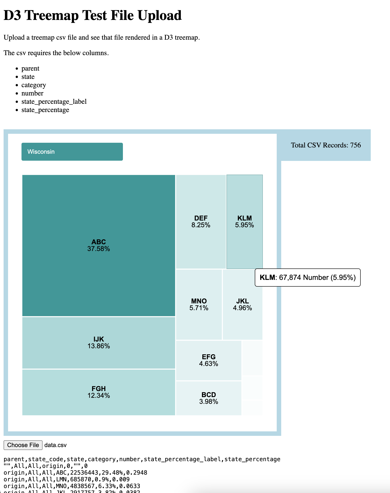

# d3_projects

My personal journey in D3.

## Biography

I am Benjamin Barlow, a multi-faceted tech nerd living in Madison, Wisconsin. I have a wide variety of skills and hobbies ranging from photography to web development. My favorite pastime has been (and probably always will be) theatre. During the four-and-a-half years I spent studying Mathematics at UW-Platteville, I participated in 20 productions. That’s almost one production every 80 days for 54 straight months (that's putting a math degree to good use!)

My real-life superpower is the ability to visualize relational data manipulation in my head. Essentially, it’s instinctively easy for me to understand, query, and plan/model relational data.

For more information, visit [benjaminbarlow.com](http://benjaminbarlow.com/) or my [profile on Mad's Theatre](https://madstheatre.com/profile/benjamin-barlow).

## d3_projects Structure

Each folder is an individual D3 project named according to the functionality/chart being explored. Each D3 project will have an `index.html` file and a data file.

I have developed a mechanism that appears wholly unique in the world of D3 development where a local file can be chosen to render in a D3 chart by the user in the browser. Essentially, open the `index.html` file in a browser and select the file with the "Choose File" button on that page. This has the below advantages.

- Easily sharable
  - Share the index.html and data file with anyone with a browser. They can open the index.html and then choose the data file and have the data rendered for them.

- Easily test different data
  - Columns can't change, but data does. Using several different data files might uncover an unexpected chart situations where a <text> element doesn't fit or any number of scenarios that should be uncovered in testing variable data.
 
- Easy to rapidly prototype D3 cahrts
  - These are single html files with no js or css dependencies. It's all in one place.

- Avoid issues connecting to remote data sources
  - It's your local files. You won't encounter CORS Policy errors.

## Goals for the Project

It is my hope that this journey builds experience in D3 and produces template code that can be reused for future D3 development.

# Project Screenshots

**/self_contained_treemap**

## My Development Environment

I feel like most resources teaching D3 overcomplicate the core concepts of development. On this journey, I’ll be limiting myself to HTML, JavaScript, CSS, and CSV files. I aim to avoid using Python, local web servers, or anything else that adds unnecessary complexity. I’ve always subscribed to K.I.S.S. (*Keep It Simple, Stupid*), and that’s the approach I’m taking here: simplicity.

### Hardware

- Inspiron 3880
  - Intel i5-10400
  - AMD Radeon 550

My primary hardware for this project will likely be my web development rig. It’s probably considered an odd CPU/GPU combination, but given the budget and availability, I am incredibly happy with it. Essentially, I found a 10th-gen i5 Dell Inspiron 3880 on Facebook Marketplace without a GPU for a great price. However, it only has a single HDMI output, and I have a three-monitor setup that I wanted to utilize. This led me to find a GPU with three display outputs that could fit. I also had to upgrade the power supply since the one it came with was limited. After some research, I settled on a 360W power supply and an AMD Radeon 550. I love it. :)

### Software

- Debian 12
- GNOME 47
- Sublime Text
- Thorium Browser
- GitHub

After distro-hopping (*including Ubuntu, Zorin, Arch, Fedora, etc.*), I’ve settled on Debian and GNOME as my daily driver Linux environment. I also have been experimenting with Pop!\_OS featuring the Cosmic DE on my Lenovo ThinkPad T490s laptop and am slowly becoming a big fan. Once the Cosmic DE goes stable, I think it may be likely it will become my daily driver.

I use DDEV for web development and have been writing code with Sublime Text for a decade. Could I use a proper IDE? Of course. But K.I.S.S. :)

The Thorium Browser has been my go-to for the last few years. I just can’t quit Chromium browsers. I’ve tried Mozilla, Opera, and others, but Chromium browsers just feel faster. And which Chromium browser is the fastest without Google bloat? Thorium.

Finally, GitHub. I learned GitHub while working at Findhelp and have grown quite fond of it.

Of course, there’s other software like a terminal, a file explorer, etc., but these are the primary and most notable tools.

It’s worth noting that I completely understand that different hardware and software preferences exist. People advocate for all sorts of setups that work for them, and that’s cool! I’m not here to say that folks developing on a laptop with a single display, an AMD CPU, Ubuntu, and a fully-featured IDE are doing it wrong. You do you, fam. All I’m saying is, this is what works for me. :)
